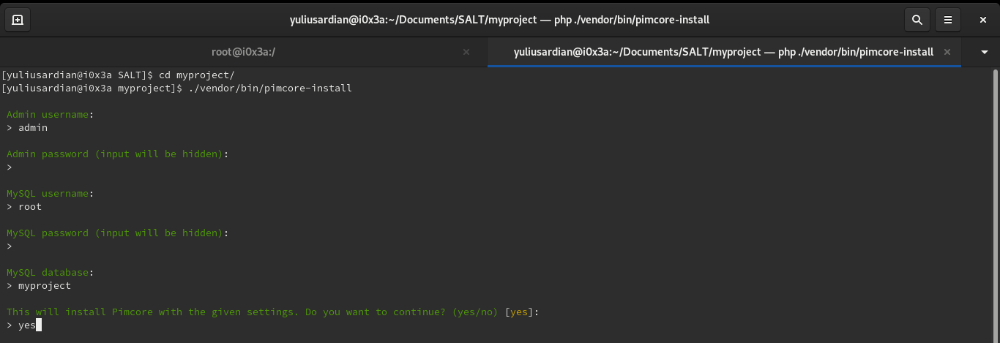

# Getting Started

## 1. Webserver

- [Apache](https://httpd.apache.org/)
- [Nginx](https://www.nginx.com/)

## 2. PHP >= 7.2

**Required Settings and Modules & Extensions**

- memory_limit >= 128M
- upload_max_filesize and post_max_size >= 100M (depending on your data)
- pdo_mysql or mysqli
- iconv
- dom
- simplexml
- gd
- exif
- file_info
- mbstring
- zlib
- zip
- intl
- opcache
- curl
- CLI SAPI (for Cron Jobs)
- [Composer](https://getcomposer.org/) (added to $PATH - see also Additional Tools Installation)

**Recommended Modules & Extensions**

- [imagick](https://www.php.net/imagick) (if not installed gd is used instead, but with less supported image types)
- [phpredis](https://github.com/phpredis/phpredis) (recommended cache backend adapter)
- [graphviz](https://www.graphviz.org/) (for rendering workflow overview)

## 3. Database Server

- MariaDB >= 10.0.0.5
- MySQL >= 5.6.4
- AWS Aurora (MySQL)
- Percona Server

## Features

- InnoDB / XtraDB storage engine
- Support for InnoDB fulltext indexes

## Permissions

All permissions on database level, specifically:

- Select, Insert, Update, Delete table data
- Create tables
- Drop tables
- Alter tables
- Manage indexes
- Create temp-tables
- Lock tables
- Execute
- Create view
- Show view

Important notes, when my first time installing Pimcore 5. I was using MariaDB 10.3 and facing some issue with `innodb`.
And fix the issue by set the global variable via mysql command line

```bash 
SET GLOBAL innodb_file_format = Barracuda
SET GLOBAL innodb_large_prefix = 1
SET GLOBAL innodb_file_per_table = 1
```

## 4. Redis (optional but recommended for caching)

All versions > 3 are supported

```
#select an appropriate value for your data
maxmemory 768mb
               
#IMPORTANT! Other policies will cause random inconsistencies of your data!
maxmemory-policy volatile-lru   
save ""
```

## 5. Install Pimcore & Dependencies

Go to your project directory and running this command on your terminal

 

```bash
COMPOSER_MEMORY_LIMIT=-1 composer -vvv create-project pimcore/skeleton myproject 
```

When finished you'll see something similiar like in the screenshot below


Change directory to your _myproject_

```bash
cd ./myproject 
```

And install Pimcore by running this command

```bash
./vendor/bin/pimcore-install
```

Please notes if you install php from the source code and have custom directory to should running those command using your own php absolute path

for example : If your php binary placed at `/opt/rh-php72/usr/bin/php`
so you have to running `pimcore-installation` using your php absolute path and following with `vendor/bin/pimcore-installation` :

```bash
/opt/rh-php72/usr/bin/php vendor/bin/pimcore-install
```

Next set up as per your needs.



Wait installation until finish


After the installation proccess, set `PIMCORE_ENVIRONMENT` variable into `dev` on your local machine, **not recommended at production server**,
to do so open your text editor, in my case I was using `nano` 

```bash
nano .env
```

`PIMCORE_ENVIRONMENT=dev`


close and save.

## 6. Setup NGINX + PHP-FPM + Pimcore

```
upstream php-pimcore6 {
    server unix:/var/run/php/pimcore.sock;
    # or alternatively you can use php-fpm port instead of php-fpm socket
    # server 127.0.0.1:9000;
}

server {
    listen       80;
    server_name  myproject.local;
    root /home/var/www/php/myproject/web;
    index index.php;

    access_log  /var/log/access.log;
    error_log   /var/log/error.log error;

    # Pimcore Head-Link Cache-Busting
    rewrite ^/cache-buster-(?:\d+)/(.*) /$1 last;

    # Stay secure
    #
    # a) don't allow PHP in folders allowing file uploads
    location ~* /var/assets/.*\.php(/|$) {
        return 404;
    }
    # b) Prevent clients from accessing hidden files (starting with a dot)
    # Access to `/.well-known/` is allowed.
    # https://www.mnot.net/blog/2010/04/07/well-known
    # https://tools.ietf.org/html/rfc5785
    location ~* /\.(?!well-known/) {
        deny all;
        log_not_found off;
        access_log off;
    }
    # c) Prevent clients from accessing to backup/config/source files
    location ~* (?:\.(?:bak|conf(ig)?|dist|fla|in[ci]|log|psd|sh|sql|sw[op])|~)$ {
        deny all;
    }

    # Some Admin Modules need this:
    # Database Admin, Server Info
    location ~* ^/admin/(adminer|external) {
        rewrite .* /app.php$is_args$args last;
    }

    # Thumbnails
    location ~* .*/(image|video)-thumb__\d+__.* {
        try_files /var/tmp/$1-thumbnails$uri /app.php;
        expires 2w;
        access_log off;
        add_header Cache-Control "public";
    }

    # Assets
    # Still use a whitelist approach to prevent each and every missing asset to go through the PHP Engine.
    location ~* ^(?!/admin/asset/webdav/)(.+?)\.((?:css|js)(?:\.map)?|jpe?g|gif|png|svgz?|eps|exe|gz|zip|mp\d|ogg|ogv|webm|pdf|docx?|xlsx?|pptx?)$ {
        try_files /var/assets$uri $uri =404;
        expires 2w;
        access_log off;
        log_not_found off;
        add_header Cache-Control "public";
    }

    location / {
        error_page 404 /meta/404;
        add_header "X-UA-Compatible" "IE=edge";
        try_files $uri /app.php$is_args$args;
    }

    # Use this location when the installer has to be run
    # location ~ /(app|install)\.php(/|$) {
    #
    # Use this after initial install is done:
    location ~ ^/app\.php(/|$) {
        send_timeout 1800;
        fastcgi_read_timeout 1800;
        # regex to split $uri to $fastcgi_script_name and $fastcgi_path
        fastcgi_split_path_info ^(.+\.php)(/.+)$;
        # Check that the PHP script exists before passing it
        try_files $fastcgi_script_name =404;
        include fastcgi.conf;
        # Bypass the fact that try_files resets $fastcgi_path_info
        # see: http://trac.nginx.org/nginx/ticket/321
        set $path_info $fastcgi_path_info;
        fastcgi_param PATH_INFO $path_info;

        # Activate these, if using Symlinks and opcache
        # fastcgi_param SCRIPT_FILENAME $realpath_root$fastcgi_script_name;
        # fastcgi_param DOCUMENT_ROOT $realpath_root;

        fastcgi_pass php-pimcore6;
        # Prevents URIs that include the front controller. This will 404:
        # http://domain.tld/app.php/some-path
        # Remove the internal directive to allow URIs like this
        internal;
    }

    # PHP-FPM Status and Ping
    location /fpm- {
        access_log off;
        include fastcgi_params;
        location /fpm-status {
            allow 127.0.0.1;
            # add additional IP's or Ranges
            deny all;
            fastcgi_pass php-pimcore6;
        }
        location /fpm-ping {
            fastcgi_pass php-pimcore6;
        }
    }
    # nginx Status
    # see: https://nginx.org/en/docs/http/ngx_http_stub_status_module.html
    location /nginx-status {
        allow 127.0.0.1;
        deny all;
        access_log off;
        stub_status;
    }
}
```